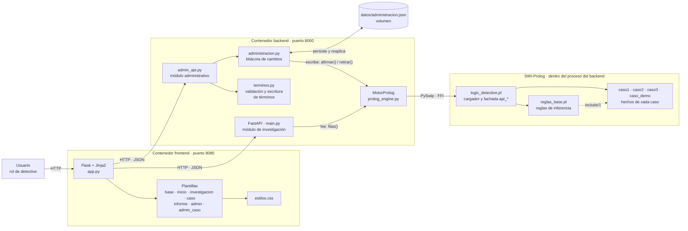
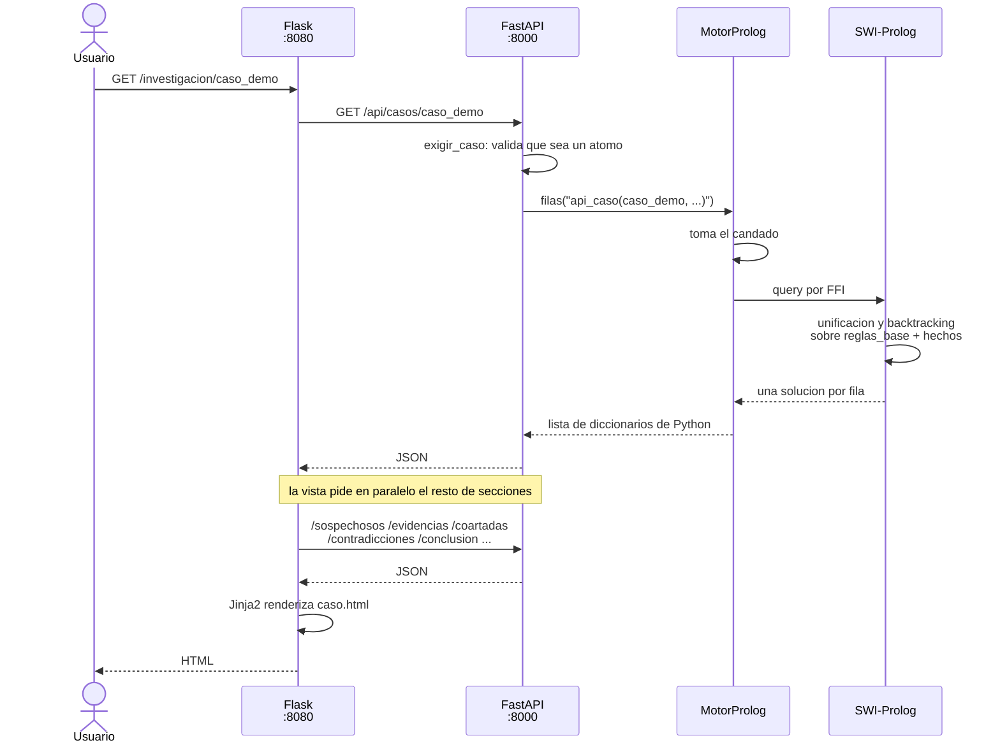
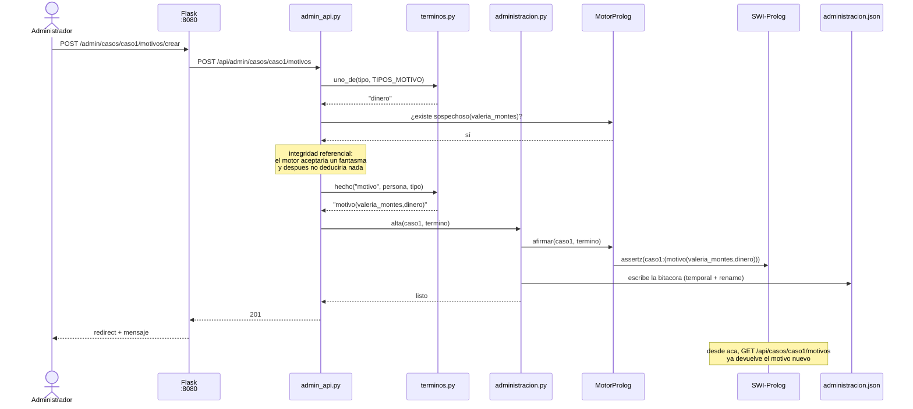
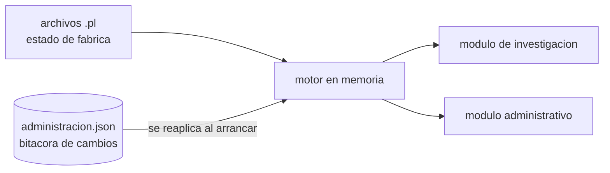
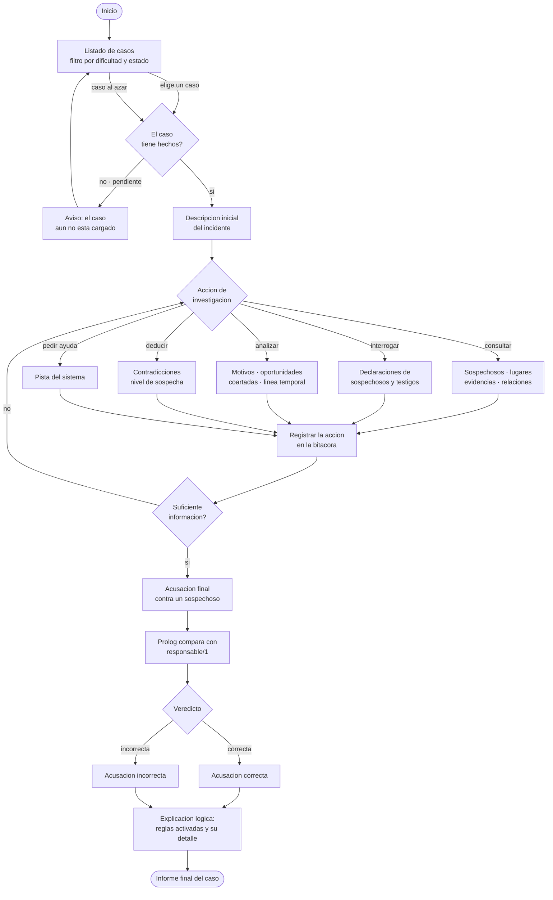
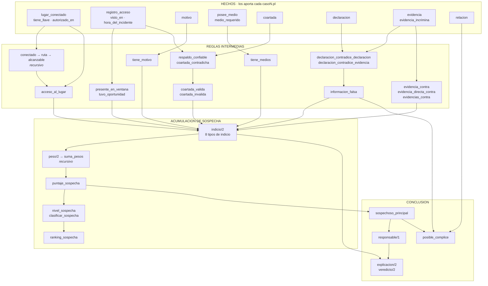
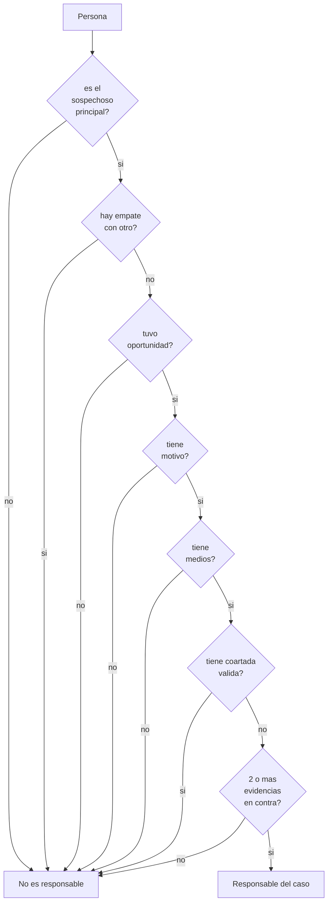
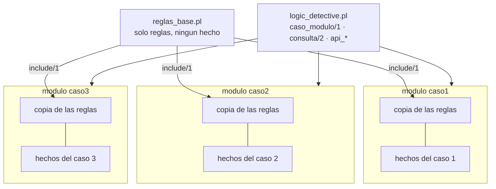
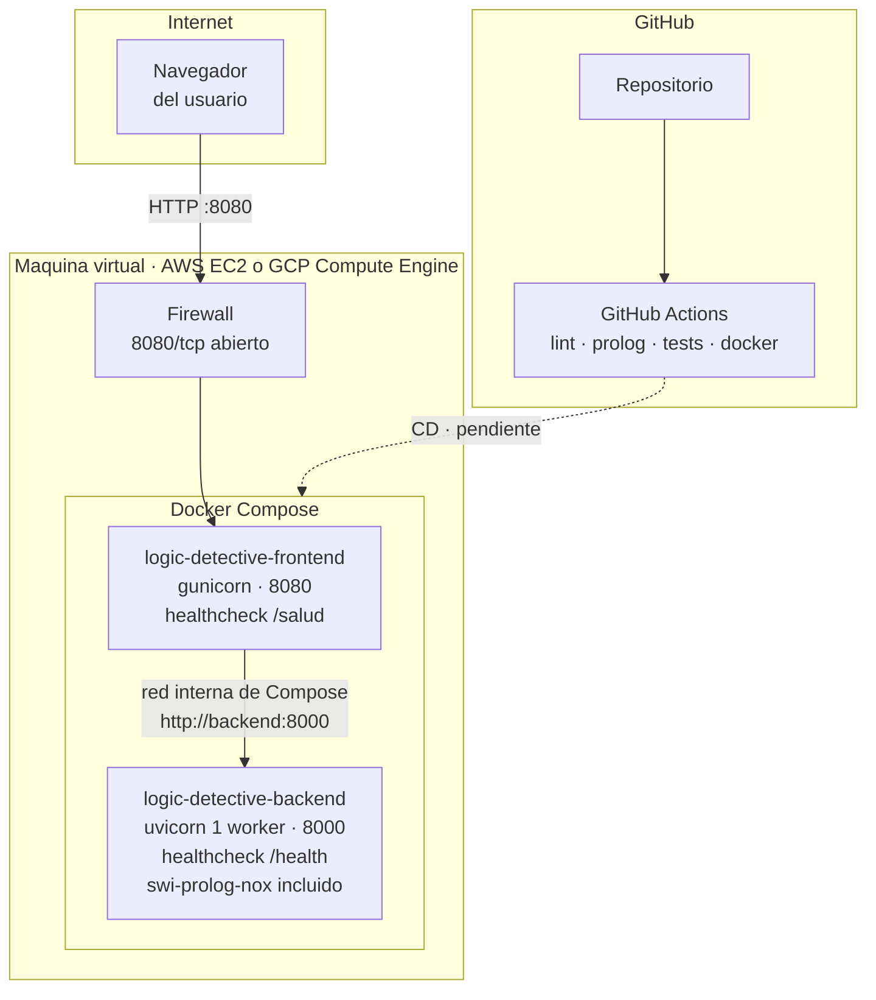
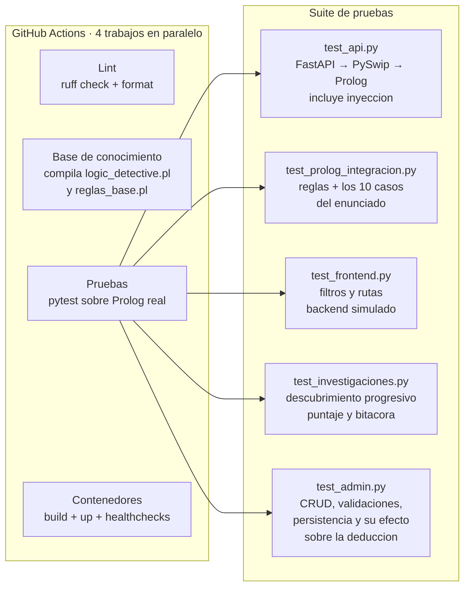

# Arquitectura del sistema

**Proyecto 1 — Logic Detective** · Inteligencia Artificial 1 · Sección A · Grupo 15
Facultad de Ingeniería, USAC · Segundo semestre 2026

Diagramas arquitectónicos y de flujo del sistema. La guía de instalación y la
referencia de la API están en [`MANUAL_TECNICO.md`](MANUAL_TECNICO.md).

> Los diagramas están escritos en Mermaid. GitHub los renderiza directamente al
> abrir este archivo; no hay imágenes sueltas que se puedan desincronizar del
> código.

---

## 1. Vista de componentes

Tres componentes y dos protocolos. El motor de inferencia **no es un servicio
aparte**: SWI-Prolog se carga dentro del proceso del backend a través de PySwip,
que enlaza `libswipl` por FFI.

Los dos módulos comparten el mismo motor cargado en memoria: la investigación lo
consulta y la administración lo escribe. Eso es lo que hace que un alta se vea en
la consulta siguiente, sin sincronizar nada y sin una segunda copia de los datos.

| Componente | Tecnología | Responsabilidad | Qué **no** hace |
| --- | --- | --- | --- |
| frontend | Flask 3.1 + Jinja2 | Presentar y recoger acciones del usuario | No razona ni guarda estado |
| backend | FastAPI + PySwip | Validar entradas, armar metas Prolog, serializar | No decide nada del dominio |
| administración | FastAPI + JSON | Editar los hechos del motor y persistir los cambios | No escribe reglas: eso sigue siendo trabajo de un `.pl` |
| motor | SWI-Prolog 9 | **Toda** la deducción | No presenta ni valida HTTP |

**Regla de diseño que atraviesa el proyecto:** toda deducción ocurre en Prolog.
Si aparece un `if` en Python que decide quién es culpable, esa lógica está en el
lugar equivocado.

---

## 2. Flujo de una consulta

Recorrido completo de `GET /investigacion/caso_demo`, desde el clic hasta el
HTML. Muestra dónde ocurre la validación, dónde el candado y dónde la inferencia.

Puntos que conviene retener:

1. **La validación ocurre antes de tocar Prolog.** Las metas se arman
   concatenando texto, así que todo lo que venga del cliente pasa por `atomo()`.
2. **Una sola consulta a la vez.** `MotorProlog` serializa con un candado porque
   SWI-Prolog no es seguro para llamadas concurrentes desde varios hilos.
3. **Una lista vacía no es un error.** Un caso todavía sin hechos responde `200`
   con `[]`; es una respuesta válida en lógica.

### 2.1 Flujo de una escritura administrativa

El camino inverso: `POST /api/admin/casos/caso1/motivos`. Muestra dónde se
valida, dónde se persiste y en qué momento el cambio queda visible para la
investigación.

Si algo falla en la validación, no se escribió nada: el término se arma entero
—y con él se comprueban todas sus referencias— **antes** del primer `assertz`.

Al arrancar, `administracion.py` vuelve a aplicar esa bitácora sobre el motor
recién cargado. Es lo que hace que los cambios sobrevivan a un reinicio sin
tocar los archivos `.pl` de fábrica:

Y como cada baja guarda el texto de los hechos que se llevó, la bitácora se
puede recorrer al revés: eso es **restaurar valores de fábrica**, y es lo que
permite demostrar el CRUD sobre los casos reales sin arruinarlos.

---

## 3. Diagrama de flujo de la investigación

Recorrido de las acciones del usuario dentro del módulo de investigación y de
los datos que las acompañan.

> Todo el recorrido está implementado. Las acciones de investigación son
> enlaces y formularios explícitos (`?analisis=`, `POST .../examinar`,
> `POST .../interrogar`, `POST .../pista`): cada una queda en la bitácora, así
> que ninguna se dispara al abrir la página. La descripción inicial del
> incidente es lo único que se ve antes de abrir la investigación.

---

## 4. Modelo de la base de conocimiento

### 4.1 Cadena de inferencia

De los hechos que aporta cada caso hasta la conclusión. Cada flecha es una
dependencia real entre predicados de `reglas_base.pl`.

`responsable/1` no se conforma con el puntaje: vuelve a exigir directamente
oportunidad, motivo, medios, ausencia de coartada válida y dos evidencias en
contra. Esas condiciones se detallan en el apartado 4.3.

### 4.2 Ponderación de los indicios

`puntaje_sospecha/2` suma el peso de cada indicio detectado. La evidencia física
y la mentira comprobada pesan más que el acceso, que casi cualquiera tiene.

| Indicio | Peso | Se activa cuando |
| --- | --- | --- |
| `acceso` | 1 | Pudo entrar a la escena |
| `oportunidad` | 2 | Estuvo en la ventana de tiempo |
| `motivo` | 2 | Tiene razones |
| `medios` | 2 | Contaba con lo que el incidente exigió |
| `multiples_evidencias` | 2 | Hay 2 o más evidencias en su contra |
| `coartada_invalida` | 3 | Su coartada no se sostiene |
| `informacion_falsa` | 3 | Mintió y se puede probar |
| `evidencia_directa` | 3 | Hay huella, ADN o video en su contra |

Máximo posible: **18 puntos**. Clasificación por rangos:

| Puntaje | Nivel |
| --- | --- |
| ≥ 12 | `muy_alto` |
| ≥ 8 | `alto` |
| ≥ 4 | `medio` |
| ≥ 1 | `bajo` |
| 0 | `nulo` |

### 4.3 Condiciones de `responsable/1`

La conclusión del caso es deliberadamente exigente. **Nunca concluye con una
sola evidencia**, que es justo lo que pide el valor formativo del enunciado
("evitar acusaciones basadas en una sola evidencia").

Un corte final deja el predicado `semidet`: el caso tiene un solo responsable y
no hace falta buscar otras derivaciones del mismo hecho.

### 4.4 Aislamiento entre casos

Cada caso es un módulo con lista de exportación vacía que incluye las reglas
textualmente:

Por eso `caso1` y `caso2` pueden tener sospechosos con el mismo nombre sin
interferir, y por eso dos integrantes pueden trabajar en paralelo sin conflictos.

---

## 5. Decisiones de diseño

| Decisión | Por qué | Qué pasaría si se cambia |
| --- | --- | --- |
| **`include/1` y no `use_module/1`** | Las reglas tienen que resolverse contra los hechos *de ese módulo* | Con `use_module` las reglas buscarían hechos en el módulo de origen, que no tiene ninguno |
| **Un módulo por caso, exportación vacía** | Aislamiento total entre casos | Colisión de nombres: el `bruno` del caso 1 se mezclaría con el del caso 2 |
| **Fachada `api_*` plana** | PySwip 0.3.x no traduce términos anidados: una lista de átomos llega como `Atom('764549')` | Los datos llegarían corruptos a la interfaz |
| **Un solo worker en el backend** | SWI-Prolog se carga en el proceso y no se comparte entre procesos | Cada worker tendría su propia máquina Prolog, o fallaría al inicializar |
| **Candado en `MotorProlog`** | SWI-Prolog no es seguro para llamadas concurrentes desde varios hilos | Corrupción de memoria bajo carga |
| **Validación con `atomo()`** | Las metas se arman concatenando texto | Inyección de código Prolog, equivalente a un SQL injection |
| **Compilar Prolog en el `docker build`** | Un error de sintaxis falla en el build, con archivo y línea | Fallaría con el contenedor ya corriendo, y más difícil de diagnosticar |
| **El backend arranca aunque Prolog falle** | Permite diagnosticar el contenedor por `/health` | El contenedor moriría al arrancar sin decir por qué |
| **Administración escribe con `assertz`/`retractall`, no editando los `.pl`** | Los `.pl` mezclan hechos y reglas; reescribirlos desde la interfaz haría que un error de formato dejara el proyecto sin arrancar | Cada alta tendría que regenerar código fuente y recargar el motor |
| **Los cambios se guardan como bitácora, no como estado final** | Permite reaplicarlos al arrancar y, sobre todo, deshacerlos en orden inverso | Sin bitácora no habría «restaurar valores de fábrica», y una eliminación sería irreversible |
| **`terminos.py` es la única forma de construir un término** | Administración interpola registros enteros con texto libre, no solo identificadores | Una comilla en una descripción rompería la cláusula; un valor malicioso sería inyección de Prolog |
| **Las ocho entidades de la interfaz son datos, no ocho plantillas** | Una sola plantilla recorre `ENTIDADES` | Ochocientas líneas de plantilla casi idéntica, que se desincronizarían entre sí |

---

## 6. Despliegue

| Aspecto | Valor |
| --- | --- |
| Puerto público | **8080** (interfaz) |
| Puerto interno | 8000 (API) — solo se expone si se quiere publicar `/docs` |
| Resolución entre contenedores | Por nombre de servicio: `http://backend:8000` |
| Orden de arranque | La interfaz espera a que el backend esté **sano**, no solo arrancado |
| Variables a definir | `SECRET_KEY` con un valor propio; `TZ=America/Guatemala` |
| Reinicio | `restart: unless-stopped` en ambos servicios |

El frontend llega al backend por la red interna de Compose, así que **no es
necesario exponer el 8000** para que la aplicación funcione.

> **Estado:** el sistema está contenedorizado, probado y con CI funcionando.
> Falta ejecutar el despliegue en la VM y agregar el paso de CD al pipeline.
> Al completarlo hay que anotar aquí la URL de la instancia.

---

## 7. Pruebas automatizadas

`reglas_base.pl` se compila **por separado** a propósito: un error de sintaxis
ahí rompe los tres casos a la vez, porque los tres la incluyen.
