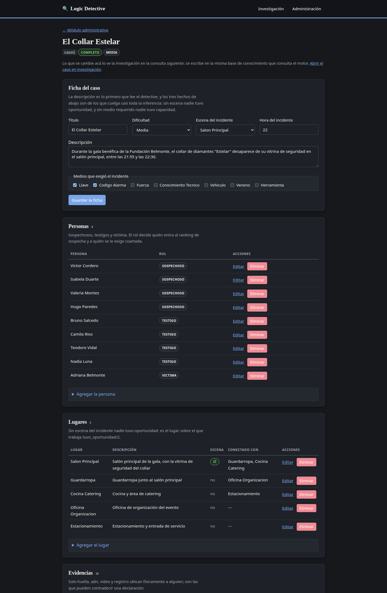
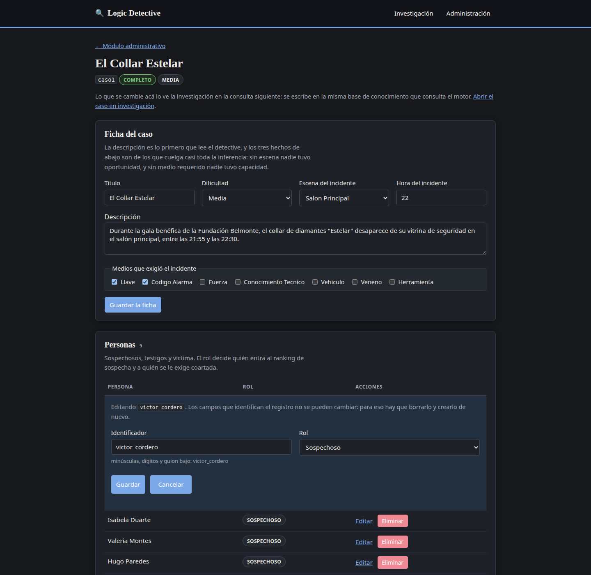
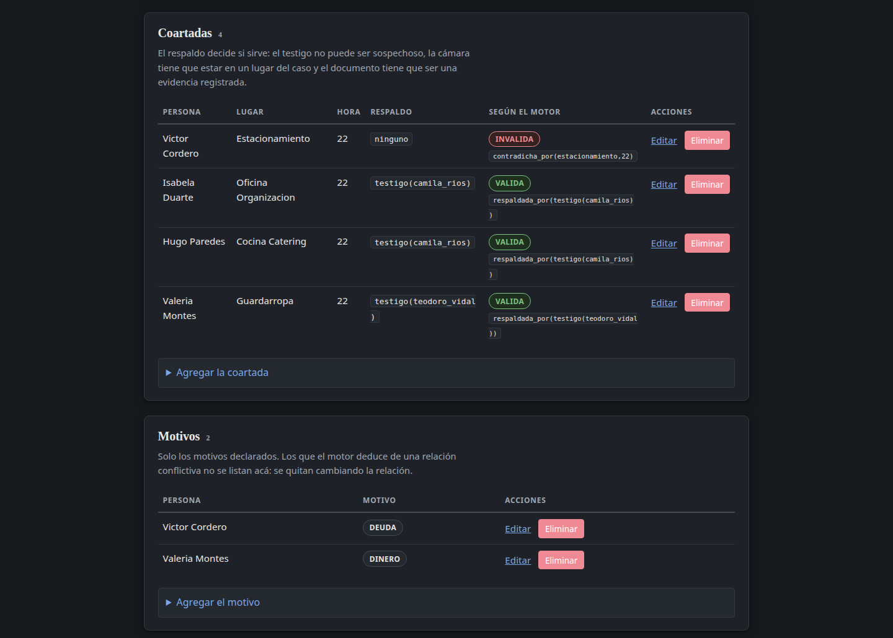

# Manual de usuario

Logic Detective es un sistema experto de investigación criminal. El usuario toma
el papel de detective: revisa evidencias, interroga sospechosos, cruza
declaraciones y acusa a alguien. Quien razona es un motor de inferencia escrito
en SWI-Prolog; la aplicación web solo pregunta y presenta.

Este manual recorre la aplicación tal como está desplegada.

---

## 1. Ingreso al sistema

La aplicación está publicada en:

**http://34.121.98.65:8080**

No hay que instalar nada ni crear una cuenta: se abre en cualquier navegador.

La pantalla de inicio muestra:

- El nombre y el propósito del sistema.
- Los casos de investigación disponibles, con su dificultad y su estado.
- **Iniciar una investigación**, que lleva al listado de casos.
- **Módulo administrativo**, para crear y editar los casos y todo su contenido.

### Los casos disponibles

| Caso | Dificultad | Incidente |
| --- | --- | --- |
| El Collar Estelar | media | Robo de un collar de diamantes durante una gala benéfica |
| El Sabotaje en el Laboratorio de I+D | difícil | Destrucción de servidores y robo de una fórmula |
| El servidor saboteado | media | Corrupción deliberada de los archivos de un servidor |
| Ejemplo: la laptop del laboratorio | fácil | Caso de demostración, más chico |

El caso marcado como **EJEMPLO** es una demostración del motor y aparece como
incompleto a propósito: no es uno de los tres casos del proyecto.

---

## 2. Módulo de investigación

### 2.1 Seleccionar un caso

Desde **Iniciar una investigación** se llega al listado. Cada caso muestra su
descripción, su dificultad y un botón para abrirlo.

### 2.2 El expediente

Al abrir un caso aparece el expediente. **La información no se entrega toda de
una vez**: al principio casi todo está oculto y hay que descubrirlo con acciones
de investigación.

Arriba está el marcador de la investigación:

| Indicador | Qué significa |
| --- | --- |
| **Puntaje** | Empieza en 100 y baja cada vez que se pide una pista |
| **Evidencias examinadas** | Cuántas de las 10 se revisaron |
| **Declaraciones tomadas** | A cuántas personas se interrogó |
| **Acciones en bitácora** | Todo lo que se hizo queda registrado |

- **Informe final** arma la conclusión razonada del caso.
- **Reiniciar** abre una investigación nueva, con la bitácora en blanco.

### 2.3 Examinar evidencias

Cada evidencia sin revisar aparece apagada, solo con su identificador (`e5`,
`e6`, …) y un botón **Examinar**. Al examinarla se revela su tipo, el lugar, la
hora, la descripción y a quién incrimina.

En la imagen anterior se ven cuatro evidencias ya examinadas (`e1` a `e4`) y
seis todavía cerradas.

### 2.4 Interrogar a sospechosos y testigos

En la sección **Declaraciones**, cada persona tiene un botón **Interrogar**. Al
usarlo se revela lo que declaró, en el mismo formato lógico que consume el
motor. Eso permite después cruzar la declaración contra las evidencias.

### 2.5 Analizar el caso

La barra **Analizar el caso** son ocho consultas al motor de inferencia. Cada
una queda anotada en la bitácora:

| Acción | Qué responde el motor |
| --- | --- |
| Evaluar a los sospechosos | Nivel de sospecha e indicios de cada persona |
| Recorrer los lugares | Los lugares del caso y qué se encontró en ellos |
| Verificar las coartadas | Qué coartada se sostiene y cuál no, y por qué |
| Revisar las relaciones | Vínculos entre las personas involucradas |
| Buscar motivos | Quién tenía un motivo posible |
| Analizar las oportunidades | Quién pudo estar en el lugar a la hora del hecho |
| Cruzar las declaraciones | Contradicciones entre lo dicho y lo probado |
| Reconstruir la línea temporal | Los acontecimientos ordenados por hora |

**Evaluar a los sospechosos** da el ranking de sospecha con los indicios que
reunió el motor sobre cada quien:

**Verificar las coartadas** dice cuál coartada está respaldada por un testigo y
cuál queda invalidada, indicando qué la contradice:

**Cruzar las declaraciones** muestra las contradicciones detectadas entre lo que
alguien declaró y lo que prueban las evidencias:

### 2.6 Pedir una pista

El botón **Pista** entrega la siguiente sugerencia del sistema y **descuenta
puntaje**. Las pistas se dan de a una y son limitadas; el marcador indica
cuántas quedan.

### 2.7 Acusar

Al final se elige un sospechoso y se emite la acusación. El sistema la compara
con la conclusión del motor y responde con el veredicto:

La acusación no cierra la investigación: queda anotada en la bitácora y se puede
seguir revisando el caso.

### 2.8 Informe final

**Informe final** arma el resultado completo de la investigación:

Contiene:

- El **puntaje final** y cuánto se llegó a descubrir.
- La **conclusión del motor**: quién es el responsable.
- La **justificación lógica**, que es lo importante: cada renglón es una regla
  de inferencia que se activó (`coartada_invalida`, `evidencia_directa_contra`,
  `declaracion_contradice_evidencia`, `tuvo_oportunidad`, `tiene_motivo`, …) con
  el hecho que la disparó. Ahí se ve por qué el sistema concluyó lo que
  concluyó.
- El nivel de sospecha del resto de involucrados, desplegable.
- La **bitácora completa**, con la hora de cada acción realizada.

---

## 3. Módulo administrativo

Se entra desde **Administración**, en la barra superior. Acá se edita lo que el
detective investiga: los casos y todo lo que contienen.

El tablero muestra:

- **El estado del motor Prolog**: si la aplicación tiene la base de conocimiento
  cargada y respondiendo.
- **Los casos**, con su avance contra los mínimos del proyecto: sospechosos,
  evidencias, lugares, declaraciones y reglas de inferencia propias. Un caso
  queda **COMPLETO** solo si cumple los cinco. Cada uno tiene su botón
  **Administrar** y su botón **Eliminar**.
- **Crear un caso**, para dar de alta uno nuevo.
- **Los cambios administrativos** hechos hasta ahora y el botón para deshacerlos
  todos.
- **Las investigaciones de esta sesión**, con su puntaje, sus acciones y un
  enlace al informe de cada una.

> **Lo que se cambia acá se ve al instante en la investigación.** No hay dos
> copias de los datos: administración escribe en la misma base de conocimiento
> que el motor consulta. Si le agregás un motivo a un sospechoso, en la
> siguiente consulta del detective ese motivo ya pesa en su nivel de sospecha.

### 3.1 Crear un caso

En el tablero, abrí **Crear un caso** y completá:

| Campo | Qué va | Ejemplo |
| --- | --- | --- |
| Identificador | minúsculas, dígitos y guion bajo, sin espacios ni acentos | `caso4` |
| Título | el nombre que verá el detective | `El robo del archivo` |
| Dificultad | fácil, media o difícil | `media` |
| Descripción | qué pasó, en una o dos frases | `Desaparece un expediente…` |

Al guardarlo, el sistema lleva directo a su editor. El caso nace vacío y con las
reglas de inferencia compartidas ya cargadas: apenas tenga personas y hechos, el
motor empieza a deducir sobre él.

### 3.2 Editar un caso

El botón **Administrar** abre el editor, con todo el caso en una sola pantalla.

Arriba está la **ficha del caso**: título, dificultad, descripción, cuál es la
escena del incidente, a qué hora ocurrió y qué medios exigió (una llave, el
código de la alarma, conocimiento técnico…). Estos tres últimos son los que más
pesan: sin escena nadie pudo tener oportunidad, y sin medio requerido nadie pudo
tener capacidad.

Debajo, una sección por cada cosa que el caso contiene:

| Sección | Qué se registra |
| --- | --- |
| **Personas** | Sospechosos, testigos y la víctima. El rol decide quién entra al ranking de sospecha. |
| **Lugares** | Los sitios del caso, cuál es la escena y qué lugares conectan entre sí. |
| **Evidencias** | Qué se encontró, de qué tipo, dónde, a qué hora y a quién incrimina. |
| **Declaraciones** | Lo que cada persona declaró. |
| **Relaciones** | Los vínculos entre las personas. |
| **Coartadas** | Dónde dice cada uno que estaba, y quién o qué lo respalda. |
| **Motivos** | Por qué alguien habría querido hacerlo. |
| **Oportunidades y medios** | Quién fue visto dónde, quién tenía llave, quién estaba autorizado y quién poseía qué. |

Cada sección funciona igual: la tabla con lo que ya hay, **Editar** y
**Eliminar** en cada fila, y **Agregar…** al final para dar de alta.

### 3.3 Agregar, modificar y eliminar

**Agregar.** Abrí *Agregar…* al final de la sección, completá el formulario y
dale a **Agregar**. Los desplegables solo ofrecen valores que el caso ya tiene:
al registrar una evidencia, el campo *Lugar* lista los lugares de ese caso y
nada más.

**Modificar.** El enlace **Editar** de una fila la abre como formulario en su
mismo lugar.

El identificador aparece bloqueado: se modifica el registro, no se cambia por
otro. Para cambiarlo hay que eliminarlo y crearlo de nuevo.

**Eliminar.** El botón **Eliminar** borra la fila y todo lo que colgaba de ella,
y el mensaje de confirmación dice exactamente qué se llevó. Por ejemplo, al
eliminar a una persona:

> Se eliminó la persona. También se quitaron: 1 sospechoso, 2 relacion,
> 1 motivo, 1 coartada, 1 declaracion.

Es a propósito: una relación con alguien que ya no está en el caso o el motivo
de un ausente no son datos incompletos, son datos falsos, y el motor deduciría
con ellos.

### 3.4 Cómo se ve el efecto de un cambio

La sección de **Coartadas** lo muestra sin salir de la pantalla: junto al hecho
que se puede editar está la columna **Según el motor**, con el veredicto que el
motor saca de él.

Una coartada sin respaldo sale como **INVÁLIDA**; una respaldada por un testigo
que no es sospechoso sale como **VÁLIDA**. Si le cambiás el respaldo a
`ninguno`, el veredicto cambia en cuanto guardás.

### 3.5 Qué pasa si algo está mal

El sistema no acepta datos que romperían el caso, y explica cuál es el problema:

| Si intentás… | El sistema responde |
| --- | --- |
| Un identificador con mayúsculas, espacios o acentos | *debe empezar con minúscula y contener solo letras, dígitos y guion bajo* |
| Repetir un identificador que ya existe | *ya existe una evidencia 'e1' en caso1* |
| Nombrar a alguien que no está en el caso | *'fantasma' no es una persona del caso caso1* |
| Una hora fuera del día | *debe estar entre 0 y 23* |
| Un tipo que el motor no conoce | *debe ser uno de: deuda, herencia, venganza, celos…* |

### 3.6 Volver todo atrás

Los cambios se guardan y sobreviven a un reinicio del servidor. Si querés dejar
los casos como estaban, el tablero tiene **Restaurar los N cambios y volver al
estado de fábrica**: deshace todo lo que se hizo desde administración, incluidas
las eliminaciones, y los casos vuelven exactamente a como salieron de sus
archivos originales.

Es la forma segura de probar el módulo sobre los casos reales sin miedo a
arruinarlos.

---

## 4. Resolución de problemas comunes

**La página no carga.**
Verificá que la dirección incluya el puerto: `http://34.121.98.65:8080`. Si la
máquina virtual está apagada no responde nada; hay que encenderla.

**Dice "No se pudo abrir la investigación".**
La interfaz no está alcanzando al motor. Abrí el módulo administrativo: si el
motor Prolog no aparece como **CONECTADO**, el problema está en el servidor y no
en el navegador.

**Los botones de examinar e interrogar no hacen nada.**
Suele ser que la investigación se cerró (por ejemplo, tras reiniciar el
servidor). Usá **Reiniciar** en el expediente para abrir una nueva.

**Perdí el avance de mi investigación.**
El avance vive en la sesión del navegador. Si se borran las cookies o se abre en
una ventana de incógnito distinta, se empieza de cero. Las investigaciones
anteriores siguen listadas en el módulo administrativo.

**El puntaje bajó solo.**
No baja solo: baja al pedir pistas. Cada pista tiene costo.

**Un caso aparece como INCOMPLETO.**
Le falta alguno de los cinco mínimos; la fila del tablero dice cuál, con el
formato `alcanzado/mínimo`. Es normal en dos situaciones: el caso marcado como
**EJEMPLO**, que es una demostración y no tiene que alcanzarlos, y un caso
recién creado desde administración, que empieza sin reglas de inferencia
propias.

**Cambié algo en administración y la investigación no lo muestra.**
Las pantallas de análisis consultan al motor cuando se pulsa su botón, no al
cargar la página. Volvé a pulsar el botón del análisis correspondiente. Si el
caso ya estaba abierto como investigación, el cambio se ve igual: no hace falta
reiniciarla.

**Borré algo que no debía.**
En el módulo administrativo, **Restaurar los N cambios y volver al estado de
fábrica** deshace todo, incluidas las eliminaciones.
