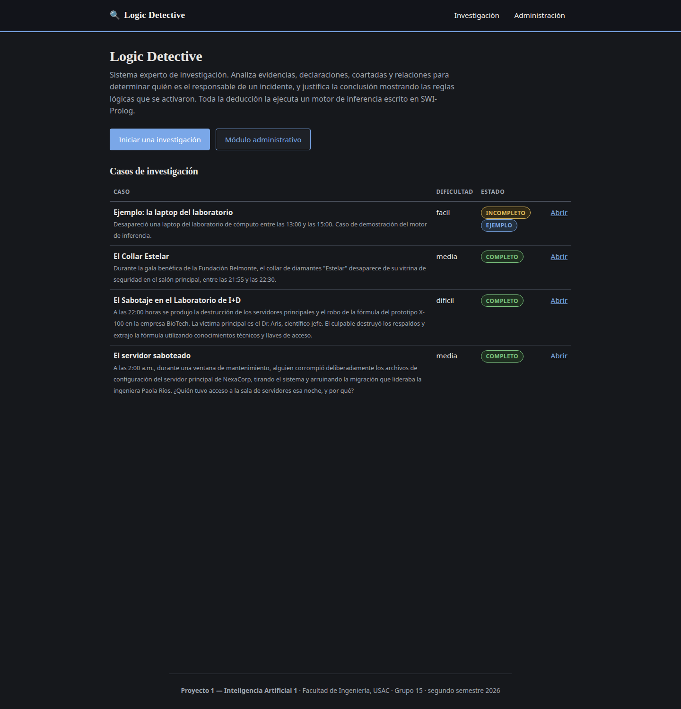
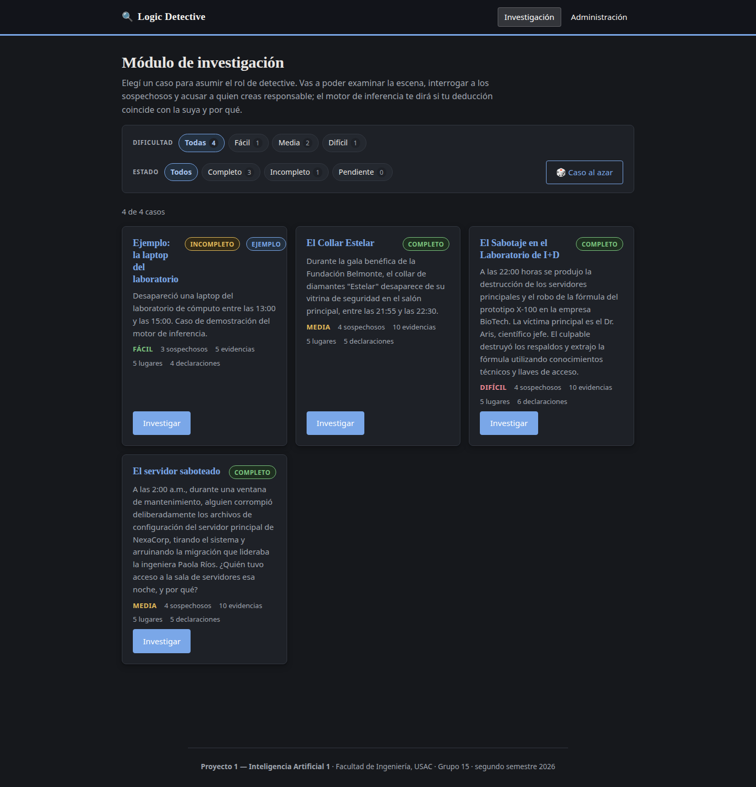
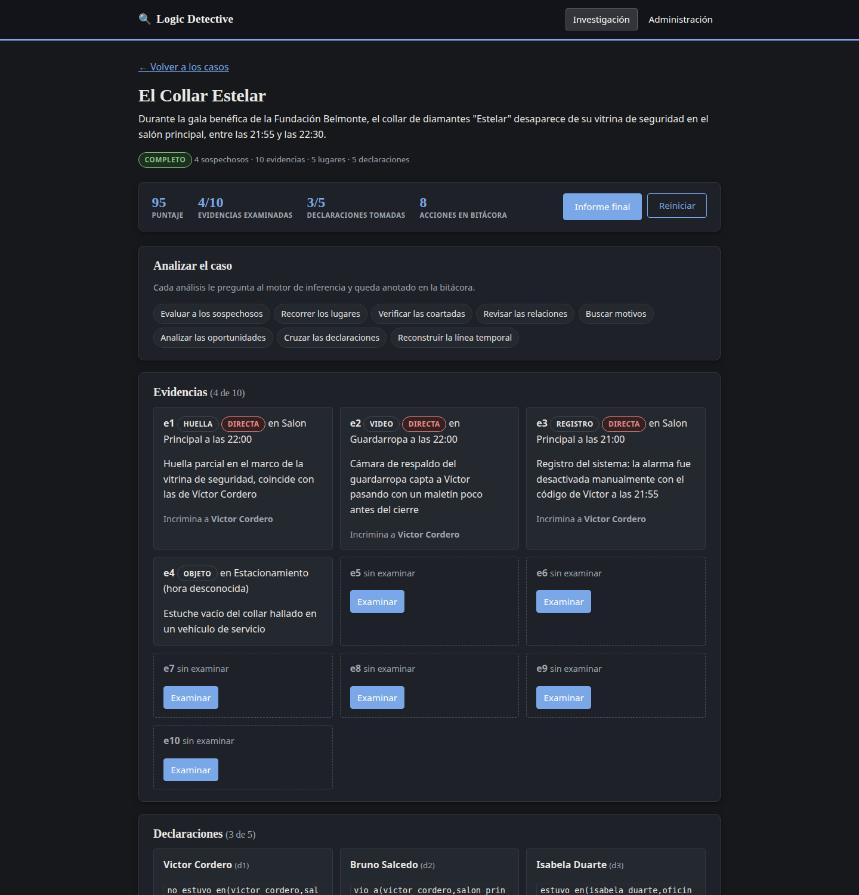
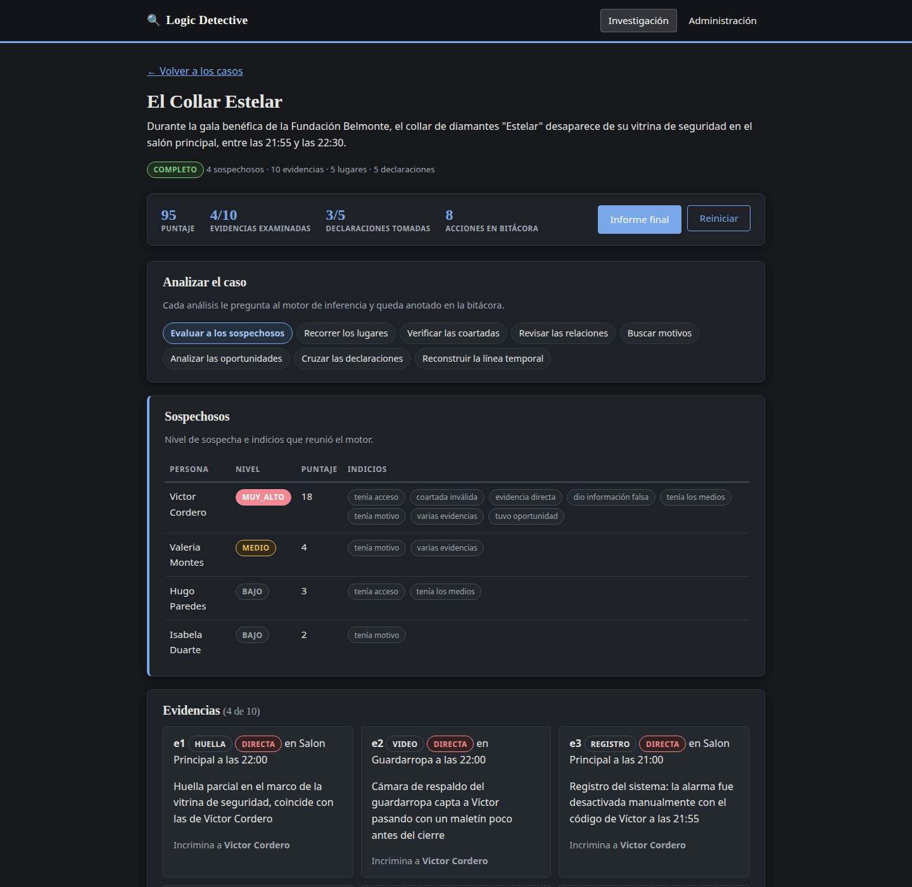
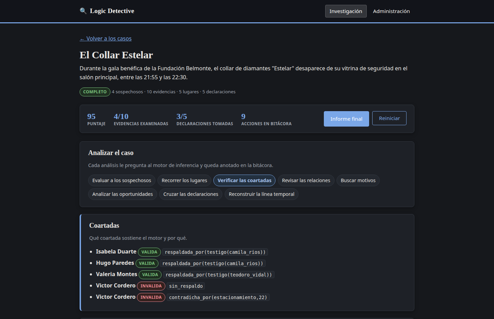
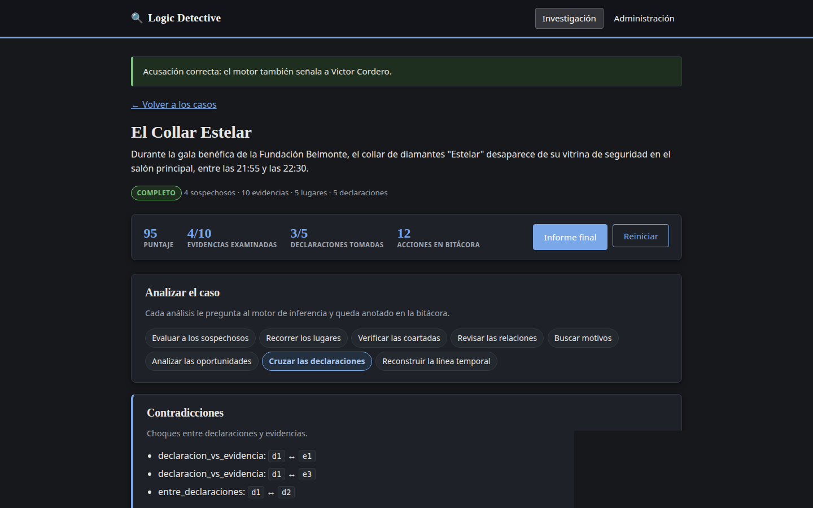
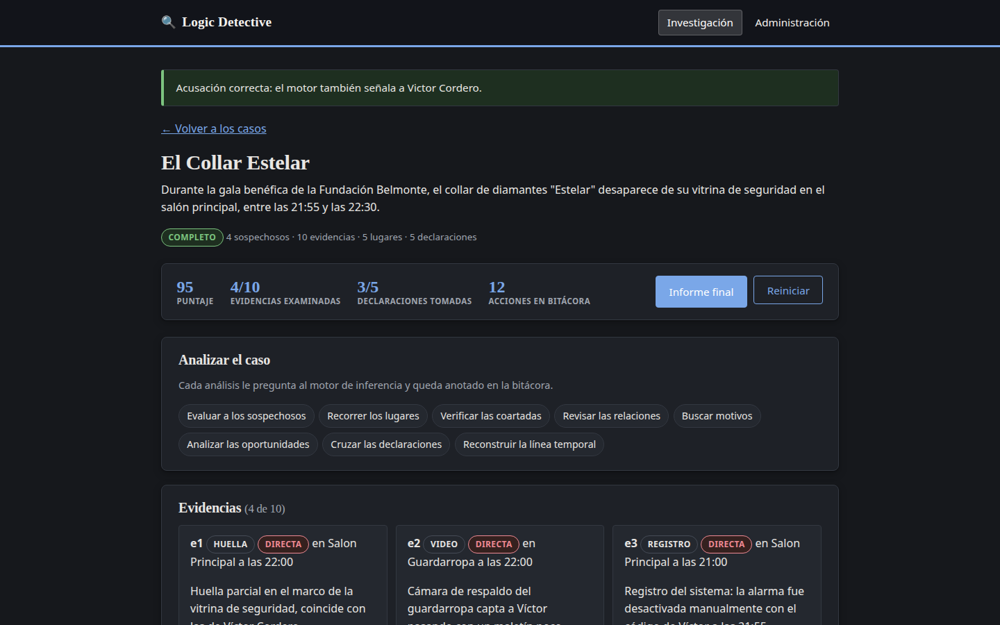
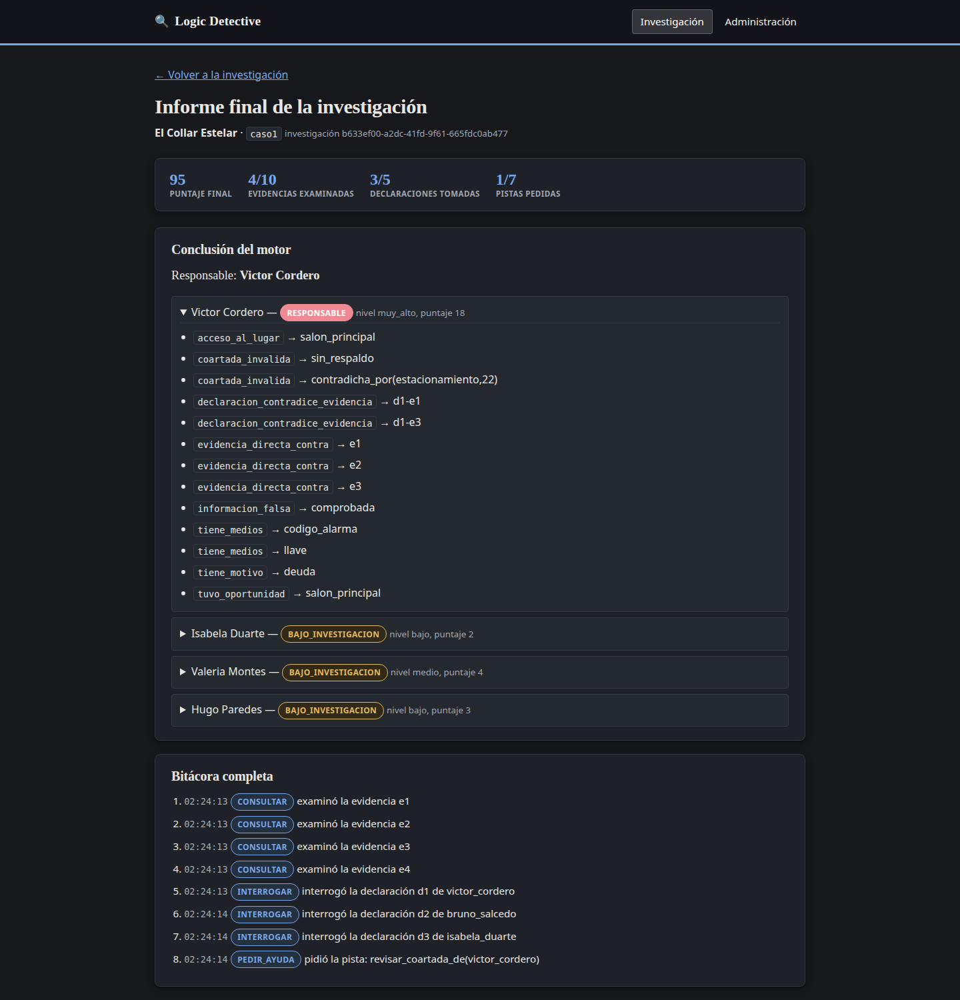
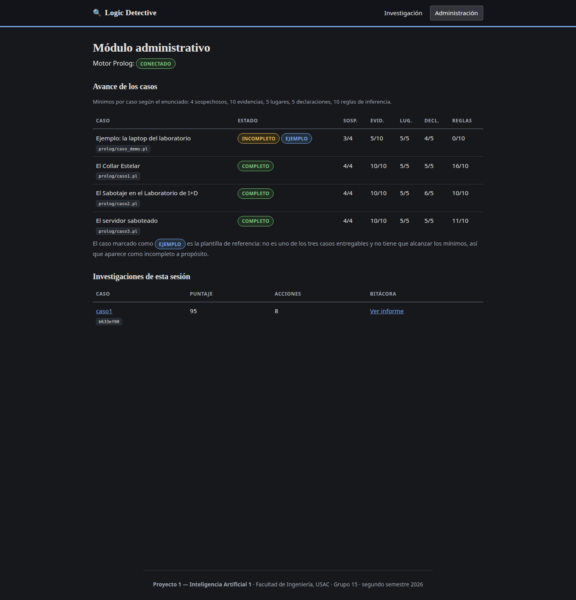

# Manual de usuario

Logic Detective es un sistema experto de investigación criminal. El usuario toma
el papel de detective: revisa evidencias, interroga sospechosos, cruza
declaraciones y acusa a alguien. Quien razona es un motor de inferencia escrito
en SWI-Prolog; la aplicación web solo pregunta y presenta.

Este manual recorre la aplicación tal como está desplegada.

---

## 1. Ingreso al sistema

La aplicación está publicada en:

**http://34.121.98.65:8080**

No hay que instalar nada ni crear una cuenta: se abre en cualquier navegador.

La pantalla de inicio muestra:

- El nombre y el propósito del sistema.
- Los casos de investigación disponibles, con su dificultad y su estado.
- **Iniciar una investigación**, que lleva al listado de casos.
- **Módulo administrativo**, para ver el estado interno del sistema.

### Los casos disponibles

| Caso | Dificultad | Incidente |
| --- | --- | --- |
| El Collar Estelar | media | Robo de un collar de diamantes durante una gala benéfica |
| El Sabotaje en el Laboratorio de I+D | difícil | Destrucción de servidores y robo de una fórmula |
| El servidor saboteado | media | Corrupción deliberada de los archivos de un servidor |
| Ejemplo: la laptop del laboratorio | fácil | Caso de demostración, más chico |

El caso marcado como **EJEMPLO** es una demostración del motor y aparece como
incompleto a propósito: no es uno de los tres casos del proyecto.

---

## 2. Módulo de investigación

### 2.1 Seleccionar un caso

Desde **Iniciar una investigación** se llega al listado. Cada caso muestra su
descripción, su dificultad y un botón para abrirlo.

### 2.2 El expediente

Al abrir un caso aparece el expediente. **La información no se entrega toda de
una vez**: al principio casi todo está oculto y hay que descubrirlo con acciones
de investigación.

Arriba está el marcador de la investigación:

| Indicador | Qué significa |
| --- | --- |
| **Puntaje** | Empieza en 100 y baja cada vez que se pide una pista |
| **Evidencias examinadas** | Cuántas de las 10 se revisaron |
| **Declaraciones tomadas** | A cuántas personas se interrogó |
| **Acciones en bitácora** | Todo lo que se hizo queda registrado |

- **Informe final** arma la conclusión razonada del caso.
- **Reiniciar** abre una investigación nueva, con la bitácora en blanco.

### 2.3 Examinar evidencias

Cada evidencia sin revisar aparece apagada, solo con su identificador (`e5`,
`e6`, …) y un botón **Examinar**. Al examinarla se revela su tipo, el lugar, la
hora, la descripción y a quién incrimina.

En la imagen anterior se ven cuatro evidencias ya examinadas (`e1` a `e4`) y
seis todavía cerradas.

### 2.4 Interrogar a sospechosos y testigos

En la sección **Declaraciones**, cada persona tiene un botón **Interrogar**. Al
usarlo se revela lo que declaró, en el mismo formato lógico que consume el
motor. Eso permite después cruzar la declaración contra las evidencias.

### 2.5 Analizar el caso

La barra **Analizar el caso** son ocho consultas al motor de inferencia. Cada
una queda anotada en la bitácora:

| Acción | Qué responde el motor |
| --- | --- |
| Evaluar a los sospechosos | Nivel de sospecha e indicios de cada persona |
| Recorrer los lugares | Los lugares del caso y qué se encontró en ellos |
| Verificar las coartadas | Qué coartada se sostiene y cuál no, y por qué |
| Revisar las relaciones | Vínculos entre las personas involucradas |
| Buscar motivos | Quién tenía un motivo posible |
| Analizar las oportunidades | Quién pudo estar en el lugar a la hora del hecho |
| Cruzar las declaraciones | Contradicciones entre lo dicho y lo probado |
| Reconstruir la línea temporal | Los acontecimientos ordenados por hora |

**Evaluar a los sospechosos** da el ranking de sospecha con los indicios que
reunió el motor sobre cada quien:

**Verificar las coartadas** dice cuál coartada está respaldada por un testigo y
cuál queda invalidada, indicando qué la contradice:

**Cruzar las declaraciones** muestra las contradicciones detectadas entre lo que
alguien declaró y lo que prueban las evidencias:

### 2.6 Pedir una pista

El botón **Pista** entrega la siguiente sugerencia del sistema y **descuenta
puntaje**. Las pistas se dan de a una y son limitadas; el marcador indica
cuántas quedan.

### 2.7 Acusar

Al final se elige un sospechoso y se emite la acusación. El sistema la compara
con la conclusión del motor y responde con el veredicto:

La acusación no cierra la investigación: queda anotada en la bitácora y se puede
seguir revisando el caso.

### 2.8 Informe final

**Informe final** arma el resultado completo de la investigación:

Contiene:

- El **puntaje final** y cuánto se llegó a descubrir.
- La **conclusión del motor**: quién es el responsable.
- La **justificación lógica**, que es lo importante: cada renglón es una regla
  de inferencia que se activó (`coartada_invalida`, `evidencia_directa_contra`,
  `declaracion_contradice_evidencia`, `tuvo_oportunidad`, `tiene_motivo`, …) con
  el hecho que la disparó. Ahí se ve por qué el sistema concluyó lo que
  concluyó.
- El nivel de sospecha del resto de involucrados, desplegable.
- La **bitácora completa**, con la hora de cada acción realizada.

---

## 3. Módulo administrativo

Se entra desde **Administración**, en la barra superior.

Muestra:

- **El estado del motor Prolog**: si la aplicación tiene la base de conocimiento
  cargada y respondiendo.
- **El avance de cada caso** contra los mínimos del proyecto: sospechosos,
  evidencias, lugares, declaraciones y reglas de inferencia propias. Un caso
  queda **COMPLETO** solo si cumple los cinco.
- **Las investigaciones de esta sesión**, con su puntaje, sus acciones y un
  enlace al informe de cada una.

---

## 4. Resolución de problemas comunes

**La página no carga.**
Verificá que la dirección incluya el puerto: `http://34.121.98.65:8080`. Si la
máquina virtual está apagada no responde nada; hay que encenderla.

**Dice "No se pudo abrir la investigación".**
La interfaz no está alcanzando al motor. Abrí el módulo administrativo: si el
motor Prolog no aparece como **CONECTADO**, el problema está en el servidor y no
en el navegador.

**Los botones de examinar e interrogar no hacen nada.**
Suele ser que la investigación se cerró (por ejemplo, tras reiniciar el
servidor). Usá **Reiniciar** en el expediente para abrir una nueva.

**Perdí el avance de mi investigación.**
El avance vive en la sesión del navegador. Si se borran las cookies o se abre en
una ventana de incógnito distinta, se empieza de cero. Las investigaciones
anteriores siguen listadas en el módulo administrativo.

**El puntaje bajó solo.**
No baja solo: baja al pedir pistas. Cada pista tiene costo.

**Un caso aparece como INCOMPLETO.**
Solo debería pasar con el caso marcado como **EJEMPLO**, que es una
demostración y no tiene que alcanzar los mínimos.
